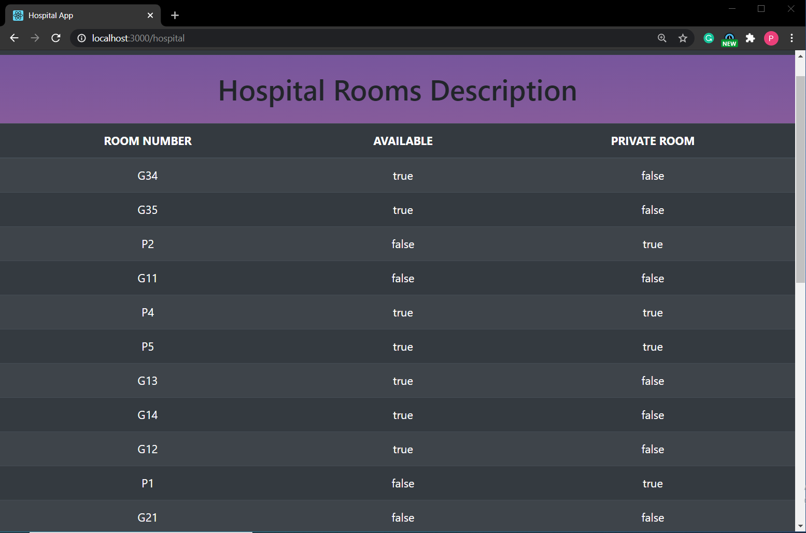
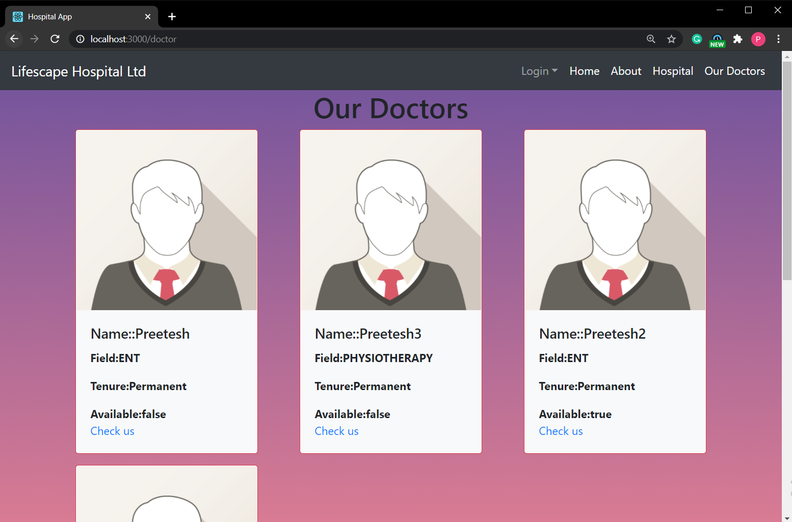
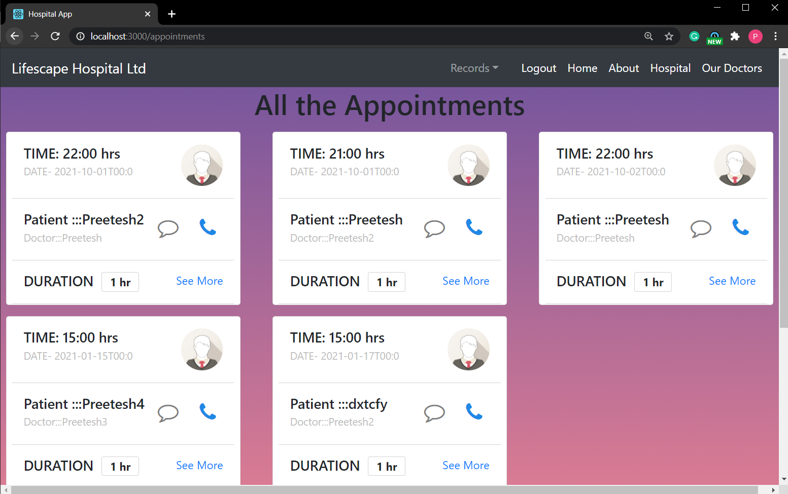

# Hospital-Management-System

Hospital Management System
Attempt at building a Hospital Management System with psql database in backend.


## Schema

| Tables        | Attributes    |
| ------------- |:-------------:|
| users | user_id(PK), name, email, password|
admins | (admin_id(PK), email, password)
hospital |(rooms,private,available)
patient |(patient_id(PK),name,age,gender,address,disease,room_number,contact,arrival_date,departure_date)
doctor | (doctor_id(PK) ,name,age,gender,tenure,specialization,available)
appointments | (doctor_id(PK),doctor_name ,patient_id ,patient_name ,date(PK),hr(PK))
leaflet_history | (doctor_id(PK), patient_id(PK),date(PK),hr(PK),disease,cure,room_number,arrival_date)

Admins Table contains the details of the admins i.e. the people who control everything.

Hospitals Table contains the room system in the hospital and availability of rooms.


Users Table contains the booking agents details such as name, email.

## Validations

- Login (Admin & User)

        Username - Not Empty & Valid
        Password - Not Empty & Valid
- Register

        Password - minimun 8 characters
        Username - Contain letters only,Shouldn't AlreadyTaken
        Full Name, Address - Not Empty
        Email - Valid, Not Empty, Shouldn't Already Registered
- Book an Appointment

        Doctor ID - Not Empty & Number and belong to one of the doctos
        Date - Not Empty & From CURRENT_DATE till 2021
        Hour - Following the 24 hour format
- Add Doctors

        Name,Gender and Age- Each Doctor's Name,Gender and Age
        Tenure-Doctors tenure whether permanent or temporary
        Specialization-Field of the doctor



## Other Functionalities

- View Appointment
        - Users can view the ticket by entering a valid UserID date and time.
- View All Available Doctos
        - Both admins and users can see the details of all the doctos associated with the hospital.
- View All Users
        - Admins can see the details of all users registered in the system.
- View All Appointments
        - Admins can also view details of appointments made by all the users.
- View All History
        - Admins can also view full medical history of every patient and each patient can view his only.
- View all the rooms
        - Admins and users both can see the status of all the rooms at any time.
- Search appointments of your interest


## Workflow

## Tech Stack

- ### Frontend

        React
        Bootstrap
        Sass
        CSS

- ### Backend

        Express JS

- ### Database

        PGSQL

- ### Server/Runtime

        Node JS

## How to run locally

- Install Node and PGSQL on your system.
- Clone the repository on your system.
- Run the command in the terminal

```js

npm install
nodemon index.js

```

- Then open another terminal and run the commands

```js

npm install
npm start

```

- Open the db.js file and configure the settings as per your needs.
- Visit "http://localhost:3000" on your browser
- Now you are all set to start!

## API Endpoints Overview

### Admin

`POST admin/add` → Adds an admin to the site

`GET admin/all` → Gives back information of all the admins; Only the authenticated user can see his data

### Appointments

`GET appointments/` → shows a list of all the appointments; Admin View

`GET appointments/one/:id&:date&:hr` → shows the particular appointmets to the admin and the user concerned;Authenticated View

`GET appointments/:id` → shows the list of appointmets to the concerned user;Authenticated View

`GET appointments/doctor/:id` → shows the list of appointmets of the concerned user;Public View

`POST appointments/:id` → Adds an appointment by the user if the doctor is free at the asked time;Authenticated View

### Doctor

`GET doctor/` → shows a list of all the doctor; Public View

`GET doctor/find/:key` → shows the particular doctos with the specific key specialization; Public View

`GET doctor/:id` → shows the details of the concerned doctor;Public View

`POST doctor/update/:id` → updates the details of a doctor; Admin only

`POST doctor/` → Adds a dcotor by the admin if the details are complete: Admin View

### History

`GET history/` → shows a list of all the history; Admin View

`GET history/:id&:doctor_id&:date&:hr` → shows the particular leaflet to the admin and the user concerned;Authenticated View

`GET history/patient/:id` → shows the list of leaflets of the concerned user; Authenticated View

`POST history/:id` → Adds an leaflet into the history of the user by the admin;Admin View

### Hospital

`GET hospital/` → Returns a list of all rooms and their status; Public View.

`POST hospital/:room_number` → Admin can update the status of a room; Must be authenticated

### Patient

`GET patient/` → Provides the list of all the patients;Admin view

`GET patient/:id` → Provides the particular patients detail;Authenticated View

`POST patient/` → adds a patient if details found authenticated; Public View

`POST patient/leave/:id` → updates a patients departure time if details found authenticated; Authenticated View

### User

`GET user/all` → Provides the list of all the users;Admin view

`POST user/add` → adds a user; Public View

## Directory Structure

```

|-- README.md
|-- client
|-- |-- node_modules
|   |-- README.md
|   |-- debug.log
|   |-- package-lock.json
|   |-- package.json
|   |-- public
|   |   |-- favicon.ico
|   |   |-- index.html
|   |   |-- logo192.png
|   |   |-- logo512.png
|   |   |-- manifest.json
|   |   `-- robots.txt
|   `-- src
|       |-- App.css
|       |-- App.js
|       |-- App.test.js
|       |-- Auth.js
|       |-- components
|       |   |-- About
|       |   |   `-- About.js
|       |   |-- Admin
|       |   |   `-- AdminLogin.js
|       |   |-- Appointments
|       |   |   |-- Appointments.css
|       |   |   |-- AppointmentsAdd.js
|       |   |   |-- AppointmentsGet.js
|       |   |   |-- AppointmentsHome.js
|       |   |   |-- AppointmentsOne.js
|       |   |   `-- DoctorAppointments.js
|       |   |-- Auth
|       |   |   `-- Auth.js
|       |   |-- Doctor
|       |   |   |-- DoctorAdd.js
|       |   |   |-- DoctorFind.js
|       |   |   |-- DoctorGet.js
|       |   |   |-- DoctorHome.js
|       |   |   `-- DoctorUpdate.js
|       |   |-- Footer
|       |   |   `-- Footer.js
|       |   |-- History
|       |   |   |-- HistoryAdd.js
|       |   |   |-- HistoryGet.js
|       |   |   |-- HistoryHome.js
|       |   |   `-- HistoryPatient.js
|       |   |-- Home
|       |   |   |-- Home.js
|       |   |   |-- home.css
|       |   |   `-- home.png
|       |   |-- Hospital
|       |   |   |-- HospitalHome.js
|       |   |   `-- HospitalUpdate.js
|       |   |-- Logout
|       |   |   `-- logout.js
|       |   |-- Navbar
|       |   |   `-- Navbar.js
|       |   |-- Patient
|       |   |   |-- PatientAdd.js
|       |   |   |-- PatientGet.js
|       |   |   |-- PatientHome.js
|       |   |   `-- PatientLeave.js
|       |   |-- ProtectedRoute.js
|       |   |-- Unauthorized.js
|       |   `-- User
|       |       |-- UserAdd.js
|       |       |-- UserAll.js
|       |       `-- UserLogin.js
|       |-- index.css
|       |-- index.js
|       |-- logo.svg
|       |-- reportWebVitals.js
|       |-- setupTests.js
|       `-- unauthorized.scss
|-- database.sql
|-- db.js
|-- images
|   |-- appointments.PNG
|   |-- doctors.PNG
|   |-- home.PNG
|   |-- hospital.PNG
|   `-- patient.PNG
|-- index.js
|-- node_modules
|-- package-lock.json
|-- package.json
`-- routes
    |-- admin
    |   `-- admin.js
    |-- appointments
    |   `-- appointments.js
    |-- doctor
    |   `-- doctor.js
    |-- history
    |   `-- history.js
    |-- hospital
    |   `-- hospital.js
    |-- patient
    |   `-- patient.js
    `-- user
        `-- user.js


```
