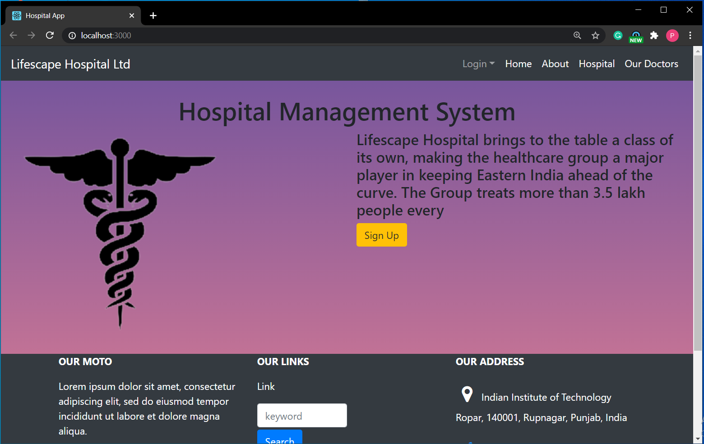

# Hospital-Management-System

Hospital Management System
Attempt at building a Hospital Management System with psql database in backend.


## Schema

| Tables        | Attributes    |
| ------------- |:-------------:|
| users | user_id(PK), name, email, password|
admins | (admin_id(PK), email, password)
hospital |(rooms,private,available)
patient |(patient_id(PK),name,age,gender,address,disease,room_number,contact,arrival_date,departure_date)
doctor | (doctor_id(PK) ,name,age,gender,tenure,specialization,available)
appointments | (doctor_id(PK),doctor_name ,patient_id ,patient_name ,date(PK),hr(PK))
leaflet_history | (doctor_id(PK), patient_id(PK),date(PK),hr(PK),disease,cure,room_number,arrival_date)

Admins Table contains the details of the admins i.e. the people who control everything.

Hospitals Table contains the room system in the hospital and availability of rooms.

Users Table contains the booking agents details such as name, email.

Books is a relation between the users and the tickets table.

Tickets Table contains the details of the tickets being booked by the booking agent for various passengers.

Passengers Table contains the details of the passengers whose tickets are booked such as name, age, gender.

Bookings Table contains the total number of seats that have been booked for a train on a particular date.

## Validations

- Login (Admin & User)

        Username - Not Empty & Valid
        Password - Not Empty & Valid
- Register

        Password - minimun 8 characters
        Username - Contain letters only,Shouldn't AlreadyTaken
        Full Name, Address - Not Empty
        Email - Valid, Not Empty, Shouldn't Already Registered
- Book an Appointment

        Doctor ID - Not Empty & Number and belong to one of the doctos
        Date - Not Empty & From CURRENT_DATE till 2021
        Hour - Following the 24 hour format
- Add Doctors

        Name,Gender and Age- Each Doctor's Name,Gender and Age
        Tenure-Doctors tenure whether permanent or temporary
        Specialization-Field of the doctor

## Other Functionalities

- View Appointment
        - Users can view the ticket by entering a valid UserID date and time.
- View All Available Doctos
        - Both admins and users can see the details of all the doctos associated with the hospital.
- View All Users
        - Admins can see the details of all users registered in the system.
- View All Appointments
        - Admins can also view details of appointments made by all the users.
- View All Historu
        - Admins can also view full medical history of every patient and each patient can view his only.
- Search trains of your interest


## Tech Stack

- ### Frontend

        React
        Bootstrap
        Sass
        CSS

- ### Backend

        Express JS

- ### Database

        PGSQL

- ### Server/Runtime

        Node JS

## How to run locally

- Install Node and PGSQL on your system.
- Clone the repository on your system.
- Run the command in the terminal

```

npm install
nodemon index.js

```

- Then open another terminal and run the commands

```

npm install
npm start

```

- Open the db.js file and configure the settings as per your needs.
- Visit "http://localhost:3000" on your browser
- Now you are all set to start!

## Directory Structure

```

|-- README.md
|-- client
|-- |-- node_modules
|   |-- README.md
|   |-- debug.log
|   |-- package-lock.json
|   |-- package.json
|   |-- public
|   |   |-- favicon.ico
|   |   |-- index.html
|   |   |-- logo192.png
|   |   |-- logo512.png
|   |   |-- manifest.json
|   |   `-- robots.txt
|   `-- src
|       |-- App.css
|       |-- App.js
|       |-- App.test.js
|       |-- Auth.js
|       |-- components
|       |   |-- About
|       |   |   `-- About.js
|       |   |-- Admin
|       |   |   `-- AdminLogin.js
|       |   |-- Appointments
|       |   |   |-- Appointments.css
|       |   |   |-- AppointmentsAdd.js
|       |   |   |-- AppointmentsGet.js
|       |   |   |-- AppointmentsHome.js
|       |   |   |-- AppointmentsOne.js
|       |   |   `-- DoctorAppointments.js
|       |   |-- Auth
|       |   |   `-- Auth.js
|       |   |-- Doctor
|       |   |   |-- DoctorAdd.js
|       |   |   |-- DoctorFind.js
|       |   |   |-- DoctorGet.js
|       |   |   |-- DoctorHome.js
|       |   |   `-- DoctorUpdate.js
|       |   |-- Footer
|       |   |   `-- Footer.js
|       |   |-- History
|       |   |   |-- HistoryAdd.js
|       |   |   |-- HistoryGet.js
|       |   |   |-- HistoryHome.js
|       |   |   `-- HistoryPatient.js
|       |   |-- Home
|       |   |   |-- Home.js
|       |   |   |-- home.css
|       |   |   `-- home.png
|       |   |-- Hospital
|       |   |   |-- HospitalHome.js
|       |   |   `-- HospitalUpdate.js
|       |   |-- Logout
|       |   |   `-- logout.js
|       |   |-- Navbar
|       |   |   `-- Navbar.js
|       |   |-- Patient
|       |   |   |-- PatientAdd.js
|       |   |   |-- PatientGet.js
|       |   |   |-- PatientHome.js
|       |   |   `-- PatientLeave.js
|       |   |-- ProtectedRoute.js
|       |   |-- Unauthorized.js
|       |   `-- User
|       |       |-- UserAdd.js
|       |       |-- UserAll.js
|       |       `-- UserLogin.js
|       |-- index.css
|       |-- index.js
|       |-- logo.svg
|       |-- reportWebVitals.js
|       |-- setupTests.js
|       `-- unauthorized.scss
|-- database.sql
|-- db.js
|-- images
|   |-- appointments.PNG
|   |-- doctors.PNG
|   |-- home.PNG
|   |-- hospital.PNG
|   `-- patient.PNG
|-- index.js
|-- node_modules
|-- package-lock.json
|-- package.json
`-- routes
    |-- admin
    |   `-- admin.js
    |-- appointments
    |   `-- appointments.js
    |-- doctor
    |   `-- doctor.js
    |-- history
    |   `-- history.js
    |-- hospital
    |   `-- hospital.js
    |-- patient
    |   `-- patient.js
    `-- user
        `-- user.js


```
